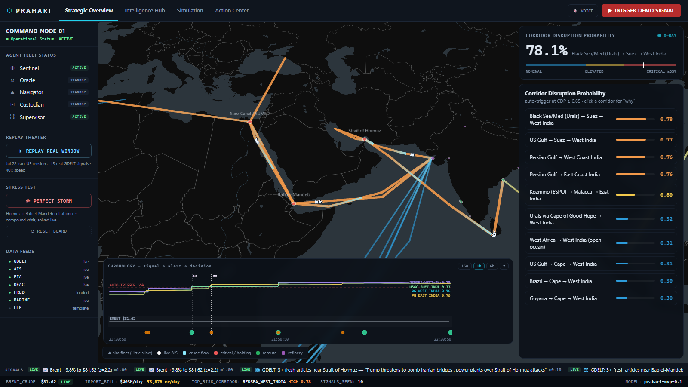
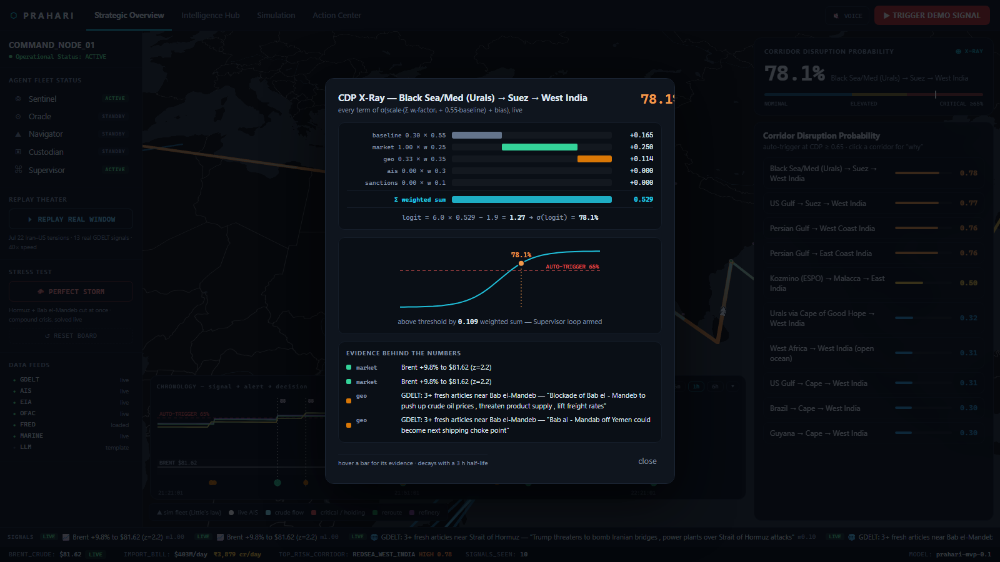
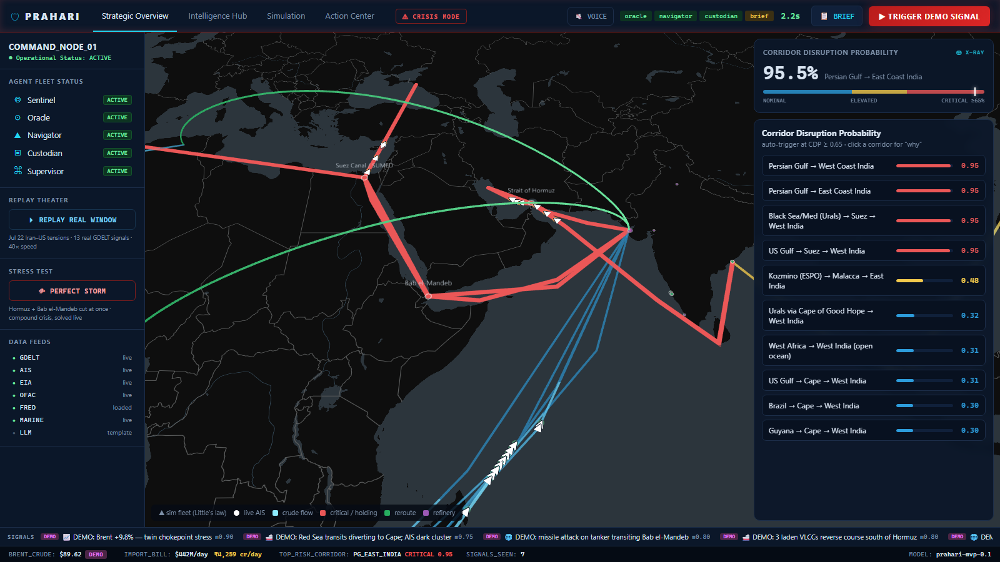
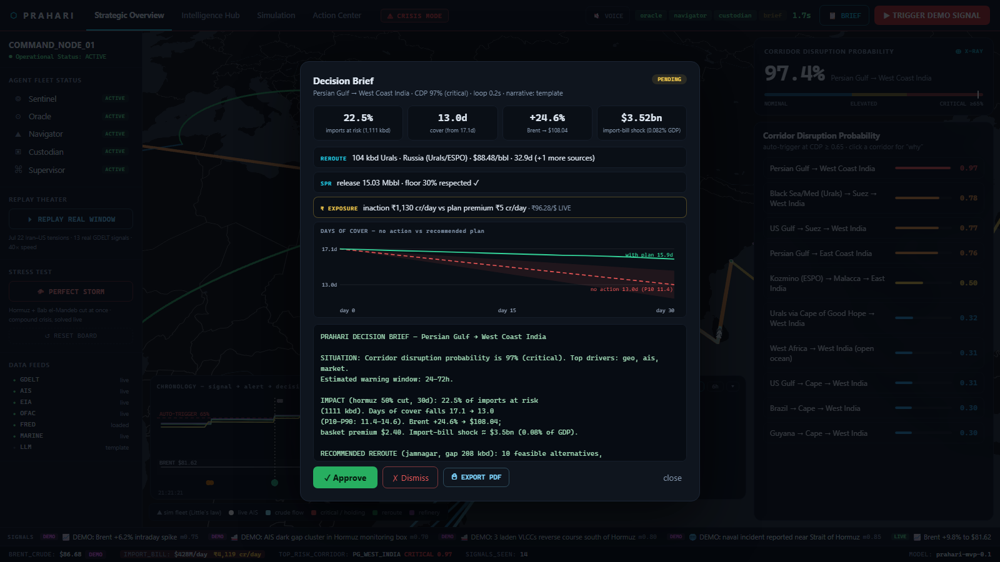
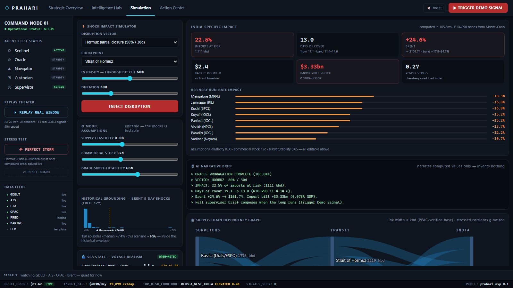
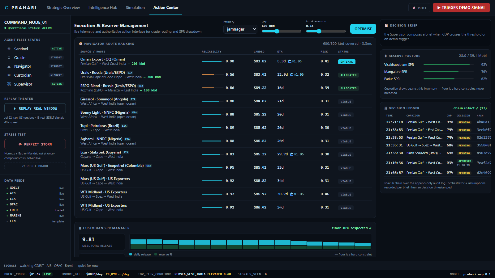
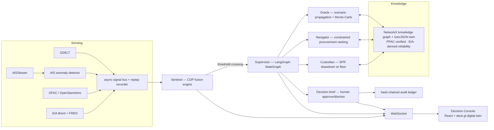

# PRAHARI — प्रहरी

**P**redictive **R**isk & **A**daptive **H**ydrocarbon **A**gentic **R**esponse **I**ntelligence

*A multi-agent sentinel that turns geopolitical and maritime signals into ranked, executable
crude-procurement and strategic-reserve decisions for India — end-to-end in under a minute.*

Hackathon PS: **AI-Driven Energy Supply Chain Resilience for Import-Dependent Economies**
Docs: [Ideation](docs/1_PRAHARI_Ideation.md) · [PRD](docs/2_PRAHARI_PRD.md) · [TRD](docs/3_PRAHARI_TRD.md) ·
[Plan](docs/4_PRAHARI_Implementation_Plan.md) · [Demo Script](docs/5_PRAHARI_Demo_Script.md)



---

## The five agents

| Agent | Role |
|---|---|
| **Sentinel** | Fuses GDELT news + AIS vessel behaviour + OFAC/OpenSanctions + Brent into an explainable per-corridor **Corridor Disruption Probability** with a lead-time estimate |
| **Oracle** | Propagates a shock through the supply-chain knowledge graph → India-specific impact (refinery run-rates, days-of-cover, price, import-bill/GDP) with Monte-Carlo P10–P90 bands |
| **Navigator** | Ranks alternative crude sources/routes under grade-compatibility, reliability, sea-state ETA, diversification and risk-ceiling constraints |
| **Custodian** | SPR drawdown schedule that never breaches the reserve floor (hard constraint) + replenishment window |
| **Supervisor** | LangGraph StateGraph (deterministic sequential fallback) that watches CDP, **auto-triggers on real news**, and composes the one-page decision brief for human approve/dismiss |

Signal → authorized decision brief runs in **~1 s** against a 60 s budget, live-timed on screen.

## What the console does

| | |
|---|---|
| **CDP X-Ray** — click any probability and see every term of the fusion equation: factor waterfall, the logit arithmetic, a sigmoid showing distance-to-auto-trigger, and the evidence (real headlines) behind each factor |  |
| **Perfect Storm** — Hormuz *and* Bab el-Mandeb cut simultaneously; with both lanes over the risk ceiling the Navigator solves from Cape/Atlantic routes only — different crisis, different answer, computed live |  |
| **Decision Brief** — impact stats, ₹ cost-of-inaction vs plan premium (live FRED INR rate), days-of-cover trajectory (no-action vs plan), approve/dismiss, and **⎙ EXPORT PDF** → a print-styled ministry one-pager, banner-marked as a synthetic exercise |  |
| **Simulation** — editable-assumption what-ifs propagated in ~100 ms, refinery run-rate impacts, and every Brent projection checked against **120 real 5-day shock episodes** (FRED, 12 y): "this scenario = P96 — inside the historical envelope" |  |
| **Action Center** — full route ranking with reliability provenance (EIA-derived tags), weather-adjusted ETAs, exclusion reasons on hover; SPR manager; hash-chained **Decision Ledger** |  |

Plus: a **Little's-law simulated tanker fleet** (counts derived from real flow volumes; U-turn /
queue / recovery choreography during a crisis; live AIS renders separately), a **chronology strip**
proving the lead-time claim (signal dots → threshold crossing → brief flag → decision, with Brent
on the same time axis), a **₹ import-bill ticker** (live Brent × PPAC-verified 4,936 kbd × live
FRED DEXINUS rate), **replay theater** (13 recorded real GDELT signals from the 2026-07-22 Iran–US
escalation), voice briefings (Web Speech), crisis mode, and a rehearsal **board reset** that shows
up as a cliff in the chronology — history is never rewritten.

## Quickstart (two terminals)

```powershell
# 1 — backend (Python 3.11+)
cd backend
python -m venv .venv && .venv\Scripts\pip install -r requirements.txt
copy .env.example .env          # add keys if you have them — everything degrades gracefully
.venv\Scripts\python -m uvicorn app.main:app --port 8000

# 2 — console (Node 20+)
cd console
npm install
npm run dev                     # http://localhost:5173
```

Open the console and hit **▶ TRIGGER DEMO SIGNAL** — or just wait: if the real news cycle is hot,
Sentinel will cross the threshold and fire the loop by itself (FR10). The rehearsed 3.5-minute
walkthrough is in [docs/5_PRAHARI_Demo_Script.md](docs/5_PRAHARI_Demo_Script.md).

## Data grounding (what's real)

| Source | Used for | Mode |
|---|---|---|
| **GDELT DOC API** | geopolitical signals, 5-min poll (no key) | live |
| **EIA open data** | daily Brent spot → market factor | live |
| **EIA bulk (2009–2026 monthly imports)** | per-supplier flow-stability **reliability proxies** — catches the 2022 Russia ban (0.56) | derived, committed |
| **FRED DCOILBRENTEU (12 y)** | 120 historical 5-day shock episodes → Oracle calibration envelope | live at boot |
| **FRED DEXINUS** | live INR/USD for the ₹ import-bill ticker and brief economics | live at boot |
| **Open-Meteo Marine** | wave heights per corridor → ETA delay factors inside Navigator ranking | live |
| **OFAC SDN + OpenSanctions** | sanction-exposure levels (conservative max-merge with seed) | live + derived |
| **PPAC** | national figures: consumption 5,486 kbd, imports 4,936 kbd, 90% dependency | **verified** |
| **AISStream** | live vessel positions (white dots, distinct from the SIM fleet) | live when upstream is up |

## Data honesty rule (NFR3)

Every signal carries a `mode` tag — **live**, **replay** (recorded real window), or **demo**
(labelled synthetic burst). The console badges each one; the chronology strip even encodes it in
the dot fill (filled = live, half = replay, hollow = demo). Nothing fabricated is ever presented
as live. The simulated fleet is explicitly SIM-tagged: vessel *counts* are real (Little's law on
actual flows), positions are simulated. National figures are PPAC-verified; remaining seed
elasticities are marked to-verify in [backend/config/seed_data.yaml](backend/config/seed_data.yaml),
and uncertainty is surfaced as P10–P90 bands, not hidden.

## Governance (NFR7)

Every brief and every human decision is appended to an audit log where each entry carries
`sha256(prev_hash + payload)` — the **Decision Ledger** re-verifies the chain server-side on every
read, so any edit or deletion is detectable. Orchestrator, model version, assumptions, and
economics are recorded per brief; decisions are timestamped.

## Architecture (TRD §1)



In-memory implementations (NetworkX KG, in-process async bus, GeoJSON twin) are the
TRD-sanctioned hackathon fallbacks — interfaces are shaped for Neo4j/Redis/PostGIS swap-in.
The LangGraph supervisor keeps a deterministic sequential fallback; the orchestrator actually
used is recorded in each brief's audit.

## API keys (all optional, all free)

| Key | Source | Without it |
|---|---|---|
| `AISSTREAM_API_KEY` | [aisstream.io](https://aisstream.io) | AIS live feed off; SIM fleet + replay cover it |
| `EIA_API_KEY` | [eia.gov/opendata](https://www.eia.gov/opendata/) | Brent stays at seed baseline (labelled) |
| `FRED_API_KEY` | [fred.stlouisfed.org](https://fred.stlouisfed.org/docs/api/api_key.html) | no shock calibration; ₹ rate falls back to a tagged seed value |
| `ANTHROPIC_API_KEY` | [console.anthropic.com](https://console.anthropic.com) | brief uses template narration instead of LLM |

GDELT + OFAC need no keys and run live out of the box.

## EIA bulk-data integration

`data/CrudeOil/PET_IMPORTS.txt` (EIA bulk download, 2009–2026 monthly crude flows by origin)
feeds `backend/scripts/eia_etl.py`, which derives a flow-stability reliability proxy per supplier
into `backend/config/derived_eia.yaml` (committed). The KG overrides seed reliabilities where
≥12 months of real signal exist; the Navigator prices unreliability into its ranking. Suppliers
with no US-bound flows (Oman, Qatar) keep seed values — labelled honestly rather than mis-scored.
`data/Coal/COAL.txt` is staged for the multi-commodity vision (TRD §10). Bulk files are
gitignored (389 MB); re-run after re-downloading: `backend\.venv\Scripts\python backend\scripts\eia_etl.py`

## Repository layout

```
backend/
  app/
    ingestion/    # GDELT, AISStream, OFAC, Brent, FRED, Open-Meteo → async signal bus (+ replay)
    cognition/    # AIS anomaly detector, CDP fusion engine, chronology history
    knowledge/    # NetworkX supply-chain knowledge graph + GeoJSON twin
    agents/       # Oracle, Navigator, Custodian, Supervisor (+ LangGraph graph)
    api/          # FastAPI routes + WebSocket stream
  config/         # seed_data.yaml + weights.yaml + derived_eia/sanctions.yaml (committed)
  scripts/        # eia_etl.py, ppac_etl.py, opensanctions_etl.py
  data/replay/    # recorded signal windows incl. the real 2026-07-22 Iran–US window
console/          # React + Vite + deck.gl Decision Console
docs/             # Ideation, PRD, TRD, Implementation Plan, Demo Script, screenshots
```
