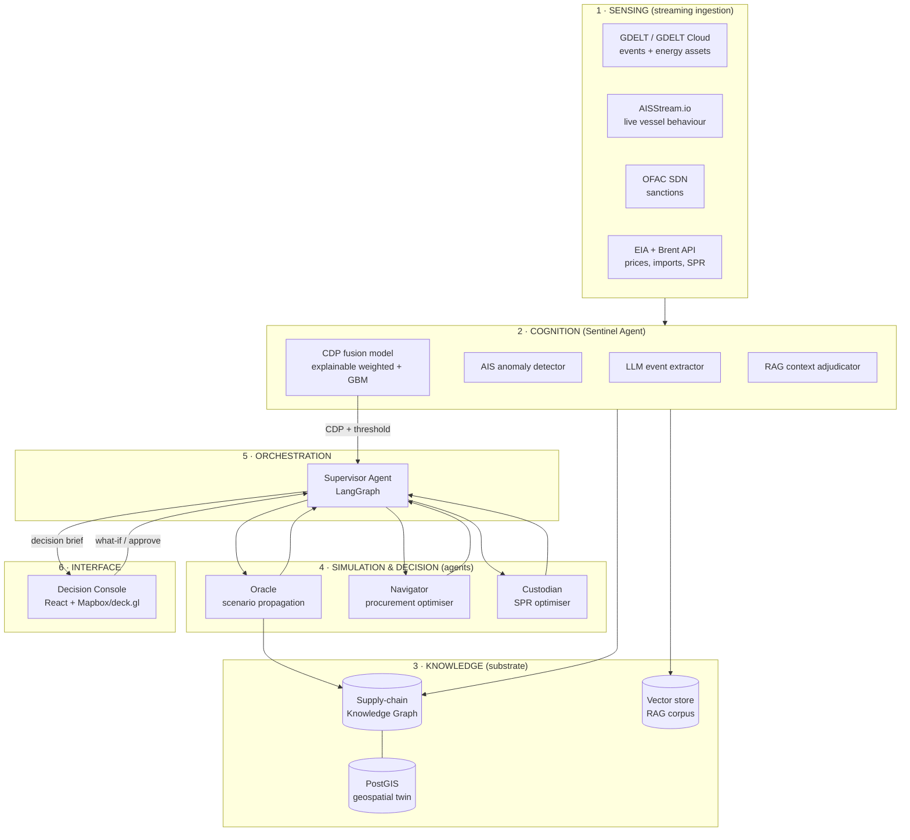

# PRAHARI — Technical Requirements Document (TRD)

*Predictive Risk & Adaptive Hydrocarbon Agentic Response Intelligence*
**Version:** 1.0 · **Status:** Hackathon MVP · **Companion docs:** Ideation, PRD, Implementation Plan

---

## 1. Architecture overview

PRAHARI is a layered, multi-agent system over a persistent knowledge-graph + geospatial digital twin.



**Layer responsibilities**

1. **Sensing** — streaming ingestion workers normalise each source into a common event/signal schema.
2. **Cognition (Sentinel)** — extract structured events from text, detect AIS anomalies, fuse into an explainable Corridor Disruption Probability (CDP), grounded by RAG.
3. **Knowledge** — the persistent substrate: the supply-chain knowledge graph, the PostGIS geospatial twin, and the RAG vector corpus.
4. **Simulation & Decision** — Oracle (scenario propagation), Navigator (procurement optimisation), Custodian (SPR optimisation).
5. **Orchestration** — Supervisor agent (LangGraph) sequences the swarm and composes the decision brief.
6. **Interface** — the Decision Console.

---

## 2. Technology stack

| Concern | Choice | Rationale |
|---|---|---|
| Language | Python 3.11 (backend), TypeScript (frontend) | Ecosystem fit for data + agents |
| Ingestion | `asyncio` workers, `websockets`, `httpx`, APScheduler | AISStream is a WebSocket; others are REST/poll |
| Streaming buffer | Redis Streams | Lightweight queue; no Kafka overhead for a hackathon |
| Relational + geo | PostgreSQL 16 + **PostGIS** | Corridors/ports/refineries as geometries; spatial queries |
| Knowledge graph | **Neo4j** (or NetworkX in-memory fallback) | Native supplier↔route↔chokepoint↔refinery traversal |
| Vector store | pgvector (or Chroma) | RAG over geopolitical/commodity corpus |
| Agent orchestration | **LangGraph** (supervisor pattern) | Deterministic multi-agent graphs, human-in-the-loop nodes |
| LLM | Anthropic Claude (via API) | Extraction, adjudication, brief-writing; tool-calling |
| Optimisation | **OR-Tools** / PuLP | Transparent, inspectable procurement + SPR optimisation |
| ML (CDP) | scikit-learn / XGBoost (thin) | Explainable fusion; feature contributions surfaced |
| Backend API | **FastAPI** + WebSocket | Async, typed, streams live updates to console |
| Frontend | React + Vite, **Mapbox GL / deck.gl**, Tailwind | Geospatial twin + dashboards |
| Packaging | Docker Compose | One-command bring-up for demo |
| Deploy | Frontend on Vercel; backend container host | Fast, reliable demo |

---

## 3. Data sources & integration

| Source | What we take | Access | Cadence | Used by |
|---|---|---|---|---|
| **GDELT DOC/GEO API** + **GDELT Cloud** (REST/MCP) | Conflict/protest/explosion events near chokepoints; ACLED-style coding; energy-asset registry; tone | Free; Cloud has REST + MCP | Hourly (Cloud) / 15-min (raw) | Sentinel |
| **AISStream.io** | Live vessel position/speed/heading; port calls; incidents; SAR aircraft | Free WebSocket, `wss://stream.aisstream.io/v0/stream`; bounding-box + MMSI filters | Real-time stream | Sentinel |
| **OFAC SDN list** | Sanctioned entities/vessels/suppliers | Free download | Daily | Sentinel |
| **EIA open-data API** | Brent/WTI spot; crude imports by API grade & country; SPR stocks | Free API key | Daily/weekly | Sentinel, Oracle |
| **Brent real-time quote API** (OilPriceAPI / equivalent) | Live Brent tick for the ticker + spike detection | Free tier | ~5-min | Sentinel |
| **PPAC / MoPNG** | India consumption, import dependency, basket price | Public datasets | Static/periodic | Oracle |
| **ISPRL** | SPR site capacities & fill (Visakhapatnam, Mangalore, Padur) | Public | Static (seed) | Custodian |

> **Data honesty rule (NFR3):** demo uses live feeds where stable; otherwise a **labelled replay** of a real recorded window. No fabricated numbers. All seed figures live in one `config/seed_data.yaml` and are marked *to-verify* against PPAC/EIA before the pitch.

**Common signal schema** (every ingested item normalises to this):
```json
{
  "signal_id": "uuid",
  "source": "gdelt|ais|ofac|eia|brent",
  "ts": "ISO-8601",
  "geo": {"lat": 0.0, "lon": 0.0, "chokepoint_id": "hormuz|bab_el_mandeb|suez|malacca|null"},
  "corridor_ids": ["hormuz_wcoast_in"],
  "type": "conflict_event|ais_anomaly|sanction_update|price_move",
  "magnitude": 0.0,
  "confidence": 0.0,
  "raw_ref": "url|record_id",
  "extracted": { "...source-specific..." }
}
```

---

## 4. Knowledge graph & geospatial twin

### 4.1 Entities (nodes)
- **Supplier** `{id, name, country, is_sanctioned, reliability}`
- **CrudeGrade** `{id, name, api_gravity, sulfur_pct, category:[light_sweet|medium|heavy_sour]}`
- **Corridor** `{id, name, origin_region, dest_region, distance_nm, base_transit_days}`
- **Chokepoint** `{id, name, geom, throughput_share}`
- **Port** `{id, name, geom, capacity_kbd, congestion_index}`
- **Refinery** `{id, name, geom, capacity_kbd, nelson_complexity, grade_profile}`
- **SPRSite** `{id, name, geom, capacity_mmt, fill_pct}`

### 4.2 Relationships (edges)
```
(Supplier)-[:PRODUCES]->(CrudeGrade)
(Supplier)-[:SHIPS_VIA]->(Corridor)
(Corridor)-[:PASSES_THROUGH]->(Chokepoint)
(Corridor)-[:LANDS_AT]->(Port)
(Port)-[:FEEDS]->(Refinery)
(Refinery)-[:CAN_PROCESS {yield_penalty}]->(CrudeGrade)
(SPRSite)-[:STORES]->(CrudeGrade)
```

This schema is what makes impact **India-specific and testable**: a Hormuz shock traverses `Chokepoint(hormuz) ← PASSES_THROUGH ← Corridor ← SHIPS_VIA ← Supplier` and downstream to `Refinery` via `FEEDS`, filtered by `CAN_PROCESS` grade compatibility.

### 4.3 Geospatial twin
PostGIS stores chokepoint polygons, corridor line-strings, port/refinery/SPR points. deck.gl renders the live twin; AIS points are overlaid in real time. Spatial joins map incoming AIS/GDELT geo-events to the nearest corridor/chokepoint.

**Seed dataset (MVP scale, all *to-verify*):** ~15 suppliers (Saudi Aramco, ADNOC, SOMO/Iraq, KPC/Kuwait, Russia, US, Nigeria, Brazil, Guyana, …), ~8 refineries with grade profiles (Jamnagar, Vadinar, Mangalore/MRPL, Kochi, Paradip, Panipat, …), 4 chokepoints (Hormuz, Bab-el-Mandeb, Suez, Malacca), 3 SPR sites (Visakhapatnam, Mangalore, Padur), ~10 corridors.

---

## 5. Models & algorithms

### 5.1 Sentinel — Corridor Disruption Probability (CDP)

Explainable, not black-box. For corridor *c* at time *t*:

```
CDP(c,t) = σ( w_g·G(c,t) + w_a·A(c,t) + w_s·S(c,t) + w_m·M(c,t) + b + δ_llm(c,t) )
```

- **G** — geopolitical intensity: density + severity (Goldstein/tone) of GDELT conflict events near *c*'s chokepoint, time-decayed.
- **A** — AIS anomaly score: fraction of tracked tankers on *c* showing reroute / speed-collapse / AIS-gap ("dark") / convoy behaviour vs. a rolling baseline.
- **S** — sanctions signal: recent OFAC SDN additions touching suppliers/tankers on *c*.
- **M** — market signal: Brent spike z-score + freight/Worldscale proxy + realised volatility.
- **δ_llm** — a bounded LLM "context adjudicator" nudge (±) with a written justification, so the human sees a rationale, not just a number.

Weights `w_*` start hand-set (transparent) and can be fit with XGBoost against labelled historical shocks post-hackathon; **feature contributions are always exposed** (this is the "why it moved" in the PRD). Output: `{cdp, confidence, top_factors[], lead_time_estimate}`.

**AIS anomaly detection.** Per vessel: rolling baseline of speed/heading; flag (a) heading reversal away from a chokepoint, (b) speed < X kn "loitering", (c) AIS gap > Y min in a monitored box ("dark"), (d) clustering/convoy. Corridor-level A = weighted share of tracked tonnage exhibiting anomalies.

**Lead-time estimate.** Time between first anomalous physical signal (AIS) and the market's own reaction (Brent move / freight spike) — surfaced as the warning window the tool buys.

### 5.2 Oracle — scenario propagation

Deterministic graph propagation + a parametric economic layer. Given event *E = {chokepoint, throughput_cut%, duration_days}*:

1. **Supply loss** — barrels/day lost = Σ over suppliers shipping via affected corridors of `volume × cut%`.
2. **Refinery impact** — allocate shortfall to downstream refineries by `FEEDS` share; run-rate reduction moderated by grade substitutability (`CAN_PROCESS`) and commercial inventory.
3. **Days-of-cover** — `(SPR + commercial_stock) / consumption`, drawn down over duration.
4. **Price impact** — Brent Δ via a supply-elasticity term; India-basket premium widens with the spot-scramble intensity.
5. **Power-sector stress** — indicator from diesel/genset-dependent load exposure.
6. **GDP / import-bill proxy** — additional import bill = `ΔPrice × import_volume`, expressed as % of GDP.

**All parameters (elasticity, substitutability, inventory, floor) are editable** and every output ships with a **Monte-Carlo uncertainty band** (sample the uncertain params N times). This is the PRD's "explicit, testable assumptions."

### 5.3 Navigator — procurement optimisation

Given a supply gap `(grade_g, volume_v, for refinery_r)`, choose a portfolio of alternatives:

- **Decision var:** `x_i` = barrels sourced from alternative *i* (supplier×grade×corridor).
- **Objective:** `min Σ x_i·(landed_cost_i + λ·risk_i·delivery_days_i)`.
- **Constraints:** `Σ x_i ≥ v`; grade compatibility `CAN_PROCESS(r, grade_i)=1` (or within a yield-penalty tolerance); `x_i ≤ tanker_availability_i`; `Σ into port ≤ port_capacity`; corridor risk `CDP_i ≤ risk_ceiling`.
- **Solver:** OR-Tools LP/MIP (small); falls back to transparent multi-criteria ranking if solver time-boxed.
- **Output:** ranked alternatives, each with `{landed_cost, ETA, corridor_risk, grade_fit, feasible}` — infeasible ones excluded/flagged with reason. λ (risk aversion) is user-tunable.

### 5.4 Custodian — SPR optimisation

Given a gap forecast `gap(t)` over horizon *H* and reserve `R0` with floor `R_min`:

- Choose daily release `d(t) ≥ 0` to **minimise unmet gap** then **minimise total drawdown**, s.t. `R(t) = R(t-1) − d(t) ≥ R_min` and `d(t) ≤ max_daily_release`.
- Suggest a **replenishment window** once forecast prices fall below a threshold.
- MVP: DP / greedy heuristic with the floor as a hard constraint; output a per-day schedule + a plain-language rationale.

### 5.5 Supervisor — orchestration (LangGraph)

A stateful graph:
```
watch(Sentinel CDP) → [threshold?] → Oracle → Navigator ┐
                                              → Custodian ┘ → compose_brief → human_review → (approve | dismiss)
```
Nodes are tool-calling agents; `human_review` is an interrupt node. State carries the triggering signal, scenario outputs, recommendations, and assumptions for the audit log (NFR7). The LLM composes the final one-page brief from structured agent outputs (no free-form number invention — it only narrates computed values).

---

## 6. API surface (FastAPI)

| Method | Endpoint | Purpose |
|---|---|---|
| `GET` | `/corridors` | Corridors + current CDP + factors |
| `GET` | `/corridors/{id}/explain` | CDP breakdown, top factors, lead-time |
| `WS` | `/stream/signals` | Live signal + CDP updates to console |
| `POST` | `/scenario/run` | Run a scenario `{chokepoint, cut%, duration, params}` → impact |
| `POST` | `/scenario/whatif` | Free-form corridor throughput adjust → impact |
| `POST` | `/procurement/optimize` | Gap → ranked alternatives |
| `POST` | `/spr/optimize` | Gap forecast → drawdown schedule |
| `POST` | `/supervisor/trigger` | Fire the full loop (demo control) |
| `GET` | `/brief/{id}` | Assembled decision brief |
| `POST` | `/brief/{id}/approve` | Record human decision |

**Scenario response (shape):**
```json
{
  "scenario_id": "uuid",
  "event": {"chokepoint": "hormuz", "cut_pct": 50, "duration_days": 30},
  "impact": {
    "imports_at_risk_pct": 42.0,
    "days_of_cover": 7.1,
    "brent_delta_pct": 11.5,
    "india_basket_premium_usd": 4.2,
    "refineries": [{"id": "jamnagar", "runrate_impact_pct": -18.0}],
    "power_stress_index": 0.34,
    "import_bill_shock_pct_gdp": 0.21
  },
  "assumptions": {"supply_elasticity": 0.08, "inventory_days": 12},
  "uncertainty": {"days_of_cover": [6.4, 7.9], "brent_delta_pct": [8.1, 15.2]}
}
```

---

## 7. Non-functional / technical constraints

- **Latency budget:** ingestion→CDP < 10 s; scenario run < 15 s; full loop < 60 s (NFR1). Achieved via cached KG traversal, pre-warmed agents, and bounded LLM calls.
- **Explainability:** every numeric output carries its factor/assumption trail (NFR2); LLM narrates only computed values.
- **Resilience:** each feed wrapped in a circuit-breaker → cache/replay fallback (NFR4); console never blocks on a dead feed.
- **Scalability (design):** ingestion is per-source and stateless; agents are stateless functions over the shared substrate → horizontal scale; adding a commodity = adding node types + a seed dataset, no re-architecture (NFR5).
- **Auditability:** Supervisor writes `{inputs, model_version, assumptions, outputs}` per run (NFR7).
- **Security (MVP):** API keys in env/secrets, never client-side; no PII; sanctions data used read-only.

---

## 8. Repository layout

```
prahari/
├── ingestion/            # async workers per source → Redis Streams
│   ├── gdelt.py  ais.py  ofac.py  eia.py  brent.py  schema.py
├── cognition/            # Sentinel
│   ├── extractor.py      # LLM event extraction
│   ├── ais_anomaly.py
│   ├── cdp.py            # fusion model + explanations
│   └── rag.py
├── knowledge/
│   ├── graph.py          # Neo4j/NetworkX loader + traversals
│   ├── geo.py            # PostGIS spatial joins
│   └── seed_data.yaml    # ALL seed figures (to-verify)
├── agents/
│   ├── oracle.py  navigator.py  custodian.py  supervisor.py  # LangGraph
├── api/                  # FastAPI app + websocket
├── console/              # React + Vite + deck.gl frontend
├── config/               # weights, thresholds, floors
├── docker-compose.yml
└── README.md
```

---

## 9. Testing & validation

- **Unit:** CDP fusion math; graph traversal correctness; optimiser constraint satisfaction; SPR floor never breached.
- **Scenario fidelity:** sanity-check the 3 canonical scenarios against the brief's stated facts (Hormuz share ≈ 40–45%; SPR ≈ 9.5 days) — outputs must be directionally and magnitudinally plausible.
- **Latency:** automated timer on the end-to-end loop (assert < 60 s).
- **Replay harness:** a recorded real signal window can be replayed deterministically for demo rehearsal.
- **Explainability audit:** every console number resolves to a factor/assumption (no orphan figures).

---

## 10. Post-hackathon technical roadmap

Backtest CDP lead-time/accuracy on 2024–2026 shocks; fit fusion weights with real labels; add live tanker-availability + port-congestion feeds; refinery telemetry; multi-commodity node types (LNG/coal/fertiliser); multi-tenant multi-country deployment; procurement-system write-back adapter.
